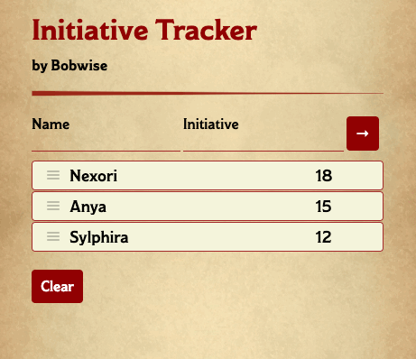

# 📓 initiative_tracker

A Dungeons & Dragons tool for tracking turn order. 🎲🐉

See it in action [here](https://bwise-initiative-tracker.herokuapp.com/).

## Features

* Autosort players as they are added to the list 📜
* Drag and drop to settle ties 🥇
* Designed for keyboard support ⌨️
* Designed for screen reader support 🗣

## Usage

1. Enter a character's name and initiative roll.
2. Drag and drop the initiative entries to adjust the order as needed

## Keyboard Usage

- Use **Tab** <kbd>Tab ↹</kbd> and **Shift** + **Tab** (<kbd>Shift</kbd> + <kbd>Tab ↹</kbd>) to navigate between the entry fields and sortable list.
- Add an entry to the list with <kbd>Enter ⏎</kbd>
- Delete an entry with **Delete** <kbd>Delete ⌦</kbd> or **Backspace** <kbd>Backspace ⌫</kbd>
- To sort the list:
    - **Tab** <kbd>Tab ↹</kbd> - focus an initiative entry
    - **Spacebar** <kbd>space</kbd> - **lift** the entry to begin dragging or **drop** the entry to end dragging.
    - **Escape** <kbd>Esc</kbd> - end dragging
    - **Up arrow** <kbd>↑</kbd> - move a lifted item up the list
    - **Down arrow** <kbd>↓</kbd> - move a lifted item down the list

## Run it Yourself 👾

1. Fork this repo.
1. `clone` your forked repo with `git clone <yourRepoUrl>`.
1. [Install Node](https://nodejs.org/en/).
1. `cd` into the project directory and run `npm install`.
1. Run `npm run start` in your project directory.
